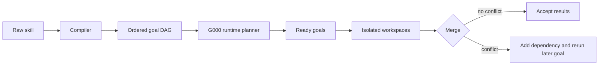
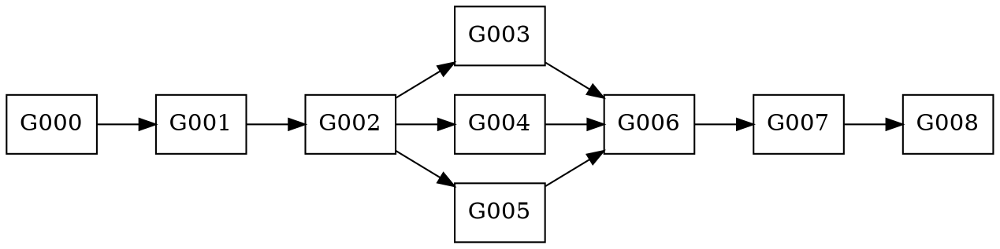

# SeaOfGoals

## Speculative parallelism for agent skills

Compile a written workflow into a task DAG, execute independent goals in isolated workspaces, and recover safely when runtime effects reveal a missing dependency.

---

# Research question

Agent skills often describe a reliable serial workflow, even when parts of that workflow could run concurrently.

SeaOfGoals asks whether an agent runtime can:

- infer useful task boundaries from the skill text
- run independent goals concurrently
- discover missing dependencies from observed effects
- preserve the original serial plan as a safe fallback.

The current study focuses on filesystem effects and end-to-end wall time.

---

# Execution model



The host owns scheduling, prompts, traces, and merge decisions. Pi agents execute goals through `bwrap`; each goal sees its own `/workspace` snapshot.

---

# Conservative merge baseline

For goal $S_i$:

$$A(S_i) = R(S_i) \cup W(S_i)$$

$$conflict(S_i,S_j) \iff W(S_i)\cap A(S_j)\neq\varnothing \\
\lor W(S_j)\cap A(S_i)\neq\varnothing$$

Read/read overlap is allowed. Any overlap involving a write creates a conflict.

When $S_i$ precedes $S_j$ in the skill:

```text
keep Si
add edge Si -> Sj
invalidate Sj and completed descendants
rerun them from the merged workspace
```

This policy lets failed speculation degrade toward the trusted serial workflow.

---

# Reducing repeated exploration

## Preload

G000 inspects the real workspace and publishes predicted files and read-only actions for later goals. The harness executes those reads and injects ordinary tool-call results into each goal's initial history.

## Incremental planning

G000 can publish several independent goal plans in one response. A goal waits for its own plan, not for G000 to finish planning the entire graph.

## Context boundary

Each goal starts with a fresh agent context. It receives explicit predecessor state and planned observations rather than ambient shared conversation history.

---

# Port-widget experiment

Task: port `connectColorMenu` across InstantSearch.js, React, Vue, common fixtures, and final validation.



Compared configurations:

| Single-Pi baseline | SeaOfGoals concurrent |
| --- | --- |
| One Pi agent receives the complete skill | One Pi agent per goal |
| Skill workflow remains serial | Ready goals run concurrently |
| Parallel tool calls remain allowed within a turn | G000 incremental planning and preload enabled |

Model: `gpt-5.6`. Each run starts from a fresh UUID workspace.

---

# Wall time across ten runs

Sorted from fastest to slowest:

| Rank | Single Pi | SoG concurrent |
| ---: | ---: | ---: |
| 1 | 169.8s | 196.3s |
| 2 | 174.0s | 201.6s |
| 3 | 181.4s | 202.3s |
| 4 | 189.7s | 208.1s |
| 5 | 201.1s | 215.4s |
| 6 | 212.4s | 215.8s |
| 7 | 219.8s | 232.7s |
| 8 | 222.9s | 232.7s |
| 9 | 229.4s | 236.5s |
| 10 | 357.8s | 276.4s |

| Statistic | Single Pi | SoG concurrent |
| --- | ---: | ---: |
| Mean | 215.8s | 221.8s |
| Median | 206.8s | 215.6s |
| Range | 169.8–357.8s | 196.3–276.4s |

The current data does not show a stable speedup. Concurrent runs vary less, but their median remains 8.8 seconds slower.

---

# Model execution time

The trace now records model phases directly from Pi's streamed Responses events:

| Trace phase | Boundary |
| --- | --- |
| `model_wait` | request/message start to first model stream event |
| `reasoning` | `thinking_start`, `thinking_delta`, `thinking_end` |
| `generation` | streamed text and tool-call construction |
| `read` / `write` | tool execution start and end |

In the latest instrumented concurrent run, model wait and ordinary generation dominate goal time. Filesystem tool execution is comparatively small.

This separates three costs that previous Read/Write tables combined: provider latency, reasoning, and visible response generation.

---

# Current interpretation

Workspace parallelism works: independent goals overlap, conflicting results can fall back to the skill's serial order, and the trace attributes effects to individual goals.

The performance bottleneck has shifted to model execution:

- separate goal agents repeat some reasoning and exploration
- G000 planning adds model calls before useful work becomes ready
- model provider latency can dominate local tool execution
- prompt-cache hits reduce input processing but do not remove output latency.

Next experiments should test predicted commands beyond file preload, stream each plan as soon as its tool call completes, and repeat the comparison on workflows with larger independent branches.
